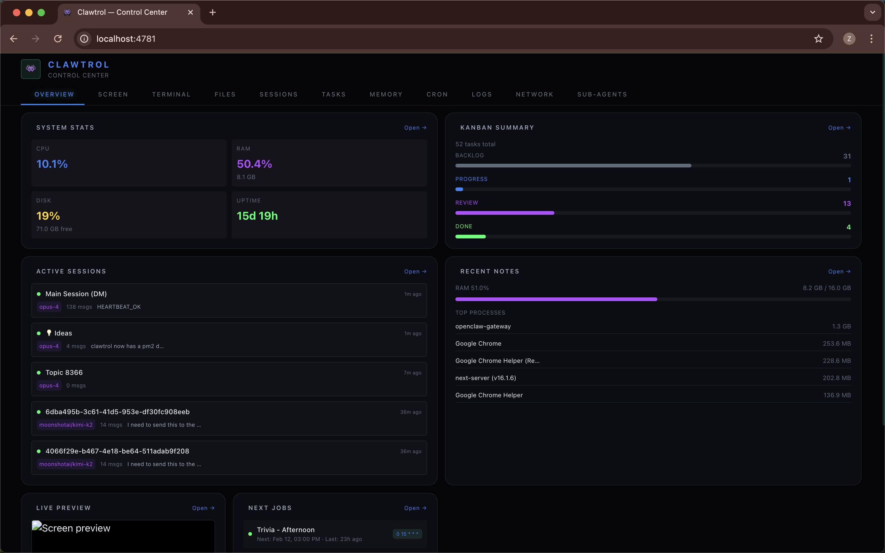

# 🎛️ Clawtrol

A sleek, modular dashboard for [OpenClaw](https://openclaw.ai) AI agents. Monitor your machine, chat with your agent, browse files, manage tasks — all from one place.

Built for headless setups (Mac minis, VPS, Raspberry Pi) but works anywhere OpenClaw runs.



## ✨ Features

| Module | What it does |
|--------|-------------|
| **Overview** | System stats — CPU, RAM, disk, uptime, weather |
| **Screen** | Remote screen viewer with click interaction (perfect for headless Macs) |
| **Terminal** | Full web terminal via ttyd |
| **Files** | Browse, read, and download files from the machine |
| **Sessions** | View and chat with OpenClaw sessions in real-time |
| **Tasks** | Lightweight kanban board for task tracking |
| **Memory** | Browse your agent's memory and markdown files |
| **Cron** | View and manage cron jobs |
| **Logs** | Gateway log viewer with filtering |
| **Network** | Tailscale peers and running processes |
| **Sub-agents** | Monitor and manage spawned sub-agents |

Every module is **optional** — enable only what you need.

## 🚀 Quick Start

```bash
# Clone and install
git clone https://github.com/nachoandmikey/clawtrol.git
cd clawtrol
pnpm install

# Configure (edit which modules you want)
cp clawtrol.config.example.ts clawtrol.config.ts

# Run
pnpm dev
```

Open [http://localhost:3001](http://localhost:3001).

## ⚙️ Configuration

Edit `clawtrol.config.ts` to customize:

```typescript
const config: ClawtrolConfig = {
  title: 'My Dashboard',
  
  // Enable only the modules you need
  modules: [
    'overview',
    'screen',
    'terminal',
    'files',
    'sessions',
  ],

  theme: {
    mode: 'dark',        // 'dark' | 'light' | 'system'
    accent: '#3b82f6',   // any CSS color
  },

  openclaw: {
    configPath: '~/.openclaw/config.json',
  },

  port: 3001,
};
```

### Module Details

<details>
<summary><strong>🖥️ Screen</strong> — Remote screen viewer</summary>

View your machine's screen remotely and click to interact. Uses native macOS `screencapture` for fast captures.

Perfect for headless Mac minis — see what's happening without VNC.

**Requirements:** macOS with `screencapture` available.
</details>

<details>
<summary><strong>⌨️ Terminal</strong> — Web terminal</summary>

Full terminal access in the browser via [ttyd](https://github.com/tsl0922/ttyd).

**Requirements:** `ttyd` installed (`brew install ttyd`).
</details>

<details>
<summary><strong>💬 Sessions</strong> — Chat with your agent</summary>

View all OpenClaw sessions and send messages directly. See conversation history, session status, and costs.

**Requirements:** OpenClaw gateway running.
</details>

<details>
<summary><strong>📋 Tasks</strong> — Kanban board</summary>

Simple task management with columns: Backlog → In Progress → In Review → Done.

Data stored locally in `~/.openclaw/control-center/tasks.json`.
</details>

## 🎨 Theming

Clawtrol uses CSS variables for easy theme customization. The default dark theme works great, but you can customize:

```typescript
theme: {
  mode: 'dark',
  accent: '#10b981', // emerald green
}
```

Or go wild with a custom CSS file — see [Theming Guide](./docs/theming.md).

## 🏗️ Architecture

```
src/
├── app/
│   ├── api/          # API routes for each module
│   │   ├── screen/
│   │   ├── files/
│   │   ├── sessions/
│   │   └── ...
│   ├── page.tsx      # Main dashboard shell
│   └── layout.tsx
├── components/
│   ├── modules/      # One component per module
│   │   ├── OverviewModule.tsx
│   │   ├── ScreenModule.tsx
│   │   ├── TerminalModule.tsx
│   │   └── ...
│   ├── ui/           # Shared UI primitives
│   └── Shell.tsx     # Dashboard shell (sidebar + tabs)
├── lib/
│   ├── config.ts     # Config types & defaults
│   └── utils.ts      # Shared utilities
```

Each module is self-contained — its own component + API route. Disable a module and its code isn't even loaded.

## 📦 Tech Stack

- **Next.js 16** — App Router
- **React 19** — RSC + Client Components
- **Tailwind CSS 4** — Styling
- **TypeScript** — Type safety
- **Radix UI** — Accessible primitives

## 🤝 Contributing

PRs welcome! Each module is independent, so you can add new ones without touching existing code.

```bash
# Add a new module
1. Create src/components/modules/YourModule.tsx
2. Add API route at src/app/api/your-module/route.ts
3. Register in src/lib/config.ts
4. That's it
```

## 📄 License

MIT — use it however you want.

---

Built with 👾 by [Mikey Nova & [Nacho](https://github.com/nachoiacovino)
